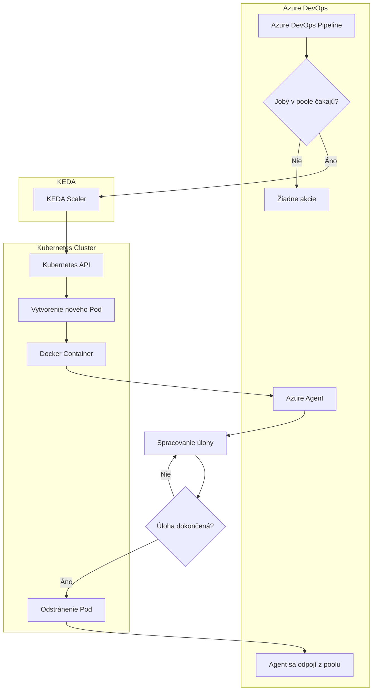

# Používateľská dokumentácia - Linux Build Machine

## Prehľad systému

Build agenti sú rozbehaní v kubernetes clusteri. Každý agent je samostatný pod. Systém umožňuje dynamické škálovanie počtu dostupných agentov vrámci poolu v závislosti od aktuálne čakajúcich úloh jobov v queue.

## Princípy fungovania

### 1. Automatické škálovanie

Systém využíva KEDA (Kubernetes Event-driven Autoscaling) na automatické škálovanie počtu build agentov. Keď sa v Azure DevOps nahromadia čakajúce úlohy, systém automaticky vytvorí nového agenta. Po dokončení úloh sa neaktívni agenti automaticky odstránia. Vždy je ale určený minimálny počet agentov, ktorí sú aktívni stále.

### 2. Kontajnerizácia

Všetci agenti bežia v Docker kontajneroch, čo zabezpečuje:

- Konzistentné prostredie pre všetkých agentov
- Izolácia od ostatných agentov

### 3. Centralizovaná správa

Na mašine sa využívajú Helm charts pre centralizovanú správu konfigurácie a nasadenia.

## Architektúra systému

## Kľúčové komponenty

### Azure DevOps

- Spravuje build pipeline a úlohy
- Poskytuje pool agentov pre spracovanie úloh
- Komunikuje s agentmi cez Azure DevOps API

### Kubernetes (K3s)

- Orchestruje Docker kontajnery
- Poskytuje API pre automatické škálovanie
- Zabezpečuje vysokú dostupnosť a odolnosť

### KEDA

- Monitoruje Azure DevOps pool
- Automaticky škáluje počet agentov
- Optimalizuje náklady a výkon

### Docker

- Kontajnerizuje build prostredie
- Zabezpečuje konzistentnosť prostredia
- Umožňuje rýchle nasadenie a aktualizácie

## Výhody systému

1. **Automatické škálovanie**: Systém automaticky prispôsobuje počet agentov aktuálnej záťaži
2. **Nákladová efektívnosť**: Agenti sa vytvárajú len keď sú potrební
3. **Vysoká dostupnosť**: Kubernetes zabezpečuje automatické reštartovanie v prípade zlyhania
4. **Jednoduchá správa**: Centralizovaná konfigurácia cez Helm charts
5. **Flexibilita**: Možnosť rýchlo pridať nové typy poolov alebo upraviť konfiguráciu

## Typické scenáre použitia

### Denná prevádzka

- Vývojári pushujú kód do Azure DevOps
- Systém automaticky vytvorí potrebný počet agentov
- Buildy sa spracovávajú paralelne
- Po dokončení sa neaktívne agenty odstránia

### Špičkové zaťaženie

- Pri veľkom množstve commitov sa automaticky vytvorí viac agentov
- Systém optimalizuje využitie dostupných zdrojov
- Buildy sa spracovávajú bez čakania

### Údržba a aktualizácie

- Aktualizácie sa aplikujú cez Helm upgrade
- Možnosť rollback v prípade problémov
- Minimálne prerušenie služby

## Monitoring a kontrola

Systém poskytuje niekoľko spôsobov monitorovania:

- **Kubernetes CLI**: Základné informácie o podoch a službách
- **K9s**: Grafické rozhranie pre správu Kubernetes
- **Azure DevOps**: Prehľad stavu poolov a agentov
- **Helm**: Správa release a konfigurácií

## Bezpečnosť

- Agenti bežia v izolovaných kontajneroch
- Prístup k Azure DevOps cez PAT tokeny
- Privátne Docker registry pre build images
- Kubernetes RBAC pre správu prístupov
