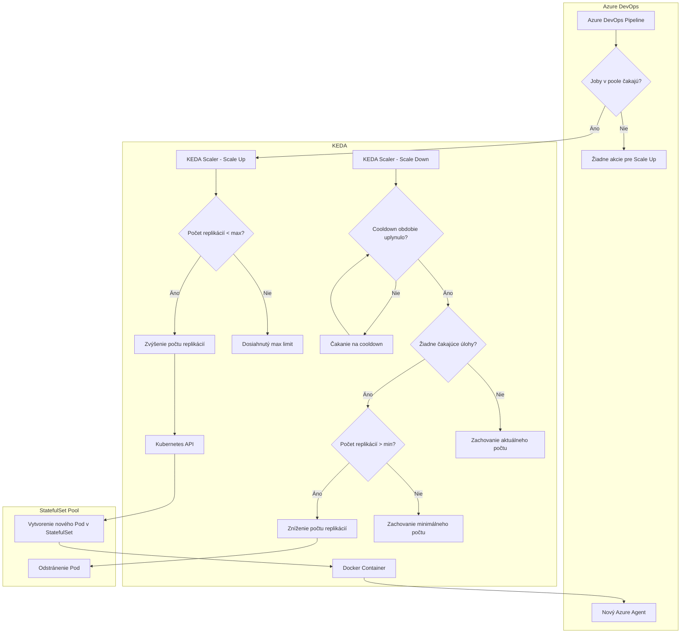

# Používateľská dokumentácia - Linux Build Machine

## Prehľad systému

Build agenti sú rozbehaní v kubernetes clusteri s jedným node-om. Každý pool je reprezentovaný ako StatefulSet, ktorý obsahuje určený minimálny a maximálny počet replikácií. Každá replikácia je jeden pod s Linuxovým Docker kontajnerom, v ktorom beží jeden Azure DevOps agent. Systém využíva KEDA (Kubernetes Event-driven Autoscaling) na automatické škálovanie počtu agentov v závislosti od počtu čakajúcich úloh v Azure DevOps pooloch.

## Princípy fungovania

### 1. Automatické škálovanie cez KEDA

Systém využíva KEDA scaler na automatické škálovanie počtu build agentov. Proces funguje nasledovne:

- **Monitorovanie**: KEDA kontinuálne monitoruje Azure DevOps pool a počet čakajúcich úloh
- **Škálovanie nahor**: Ak sú v poole čakajúce úlohy, KEDA vytvorí nový pod (replikáciu) v StatefulSet
- **Škálovanie nadol**: Po určitom cooldown období a ak nie sú čakajúce úlohy, KEDA znižuje počet podov
- **Limity**: Škálovanie je obmedzené na minimálny a maximálny počet replikácií definovaný pre každý pool

### 2. StatefulSet architektúra

Každý pool je implementovaný ako StatefulSet s nasledujúcimi vlastnosťami:

- **Stabilné identity**: Každý pod má stabilné meno (napr. `build-be-1`, `build-be-2`) a negeneruje náhodné čísla pre pody. číslovanie je od 1
- **Persistentné úložisko**: Cez PersistentVolumeClaim je vytvorené zdieľané úložisko medzi agentmi. Využíva sa na cache. Ak sa aj pody rušia, tak cache sa nezmaže.

### 3. Kontajnerizácia

Všetci agenti bežia v Docker kontajneroch, čo zabezpečuje:

- Konzistentné prostredie pre všetkých agentov
- Izolácia od ostatných agentov
- Jednoduchá aktualizácia a správa

### 4. Centralizovaná správa

Na mašine sa využívajú Helm charts pre centralizovanú správu konfigurácie a nasadenia poolov do kubernetesu.

## Architektúra poolu

## Kľúčové komponenty

### Azure DevOps

- Spravuje build pipeline a úlohy
- Poskytuje pool agentov pre spracovanie úloh
- Komunikuje s agentmi cez Azure DevOps API
- Poskytuje informácie o čakajúcich úlohách pre KEDA

### Kubernetes (K3s) - Single Node Cluster

- Orchestruje Docker kontajnery
- Poskytuje API pre automatické škálovanie
- Spravuje StatefulSets a ich replikácie

### KEDA (Kubernetes Event-driven Autoscaling)

- Monitoruje Azure DevOps pool a počet čakajúcich úloh
- Automaticky škáluje StatefulSets podľa definovaných pravidiel
- Rešpektuje minimálne a maximálne limity replikácií

### StatefulSet

- Poskytuje stabilné identity pre pody
- Zabezpečuje ordinálne číslovanie (build-be-1, build-be-2, ...)

### Docker

- Kontajnerizuje build prostredie
- Zabezpečuje konzistentnosť prostredia
- Umožňuje rýchle nasadenie a aktualizácie

## Proces škálovania

### Škálovanie nahor (Scale Up)

1. **Monitorovanie**: KEDA každých 30 sekúnd (dá sa prispôsobiť) kontroluje počet čakajúcich úloh v Azure DevOps pool
2. **Vyhodnotenie**: Ak sú čakajúce úlohy a aktuálny počet replikácií je menší ako maximum
3. **Spustenie**: Kubernetes vytvorí nový pod (replikáciu) s Docker kontajnerom

### Škálovanie nadol (Scale Down)

1. **Cooldown**: Po triggernutí scale up eventu sa čaká 300 sekúnd (dá sa prispôsobiť) kým začne kontrola pre škálovanie nadol
2. **Vyhodnotenie**: Ak nie sú čakajúce úlohy a počet replikácií je väčší ako minimum
3. **Odstránenie**: KEDA zníži počet replikácií StatefulSet, t.j. odstráni pod

### Konfigurácia škálovania

Pre každý pool sú definované nasledujúce parametre:

- **minReplicas**: Minimálny počet replikácií (vždy aktívnych agentov)
- **maxReplicas**: Maximálny počet replikácií
- **pollingInterval**: Interval kontroly čakajúcich úloh (30s)
- **cooldownPeriod**: Obdobie čakania pred znížením (300s)
- **targetPipelinesQueueLength**: Cieľový počet čakajúcich úloh pre škálovanie (1)
